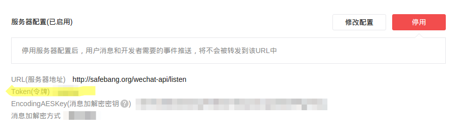

# wechat-notification

通过微信公众号, 将通知消息推送至个人微信. 无需认证公众号, 可群发.

## DEMO

demo 环境的公众号


关注后发送 `dy` 2 个英文字母, `订阅`消息推送.

通过 [http://safebang.org/wechat-api/send?msg=hello](http://safebang.org/wechat-api/send?msg=hello), 推送消息.

其中, hello 为要推送的消息


## 服务器部署

#### clone 并安装依赖

```shell
$ git clone git@github.com:JackonYang/wechat-notification.git
$ cd wechat-notification
$ sudo pip install -r requirements.txt
```

#### 启动服务器

微信要求走 80 端口, linux 监听 80 端口需要 root 权限.

```shell
$ sudo python app.py --port=80 --username=xxxx --password=xxxx --token=xxxx
```

其中, 

username 和 password 是微信公众号的用户名和密码.

token 是 `开发者中心-服务器配置` 中设置的 token




## 自定义操作指令

默认指令:

- dy: 订阅
- td: 退订
- ls: 已订阅用户列表
- help: 帮助文档

在 CmdRoot 类中增加 classmethod 方法即可.

方法名必须以 `cmd_` 为前缀, 依次接收 fakeid, user(nickname) 两个参数.
例如, `dy` 命令对应的 `cmd_dy` 定义如下:

```python
class CmdRobot:
    @classmethod
    def cmd_dy(self, fakeid, user):
        user_fakeid[user] = fakeid
        return 'subscribed. nickname={}, fakeid={}'.format(user, fakeid)
```

## 本地调试

每次都在 server 上进行代码调试, 不方便.
可以通过 nginx 转发, 实现本地调试.

nginx 参考配置如下:

```shell
upstream tornadoes {
    server 106.44.127.160:8002;  # 开发环境 IP: port
}

server {
    listen 80;
    server_name safebang.org www.safebang.org;

    root /home/jackon/safebang;
    index index.html index.htm;

    location / {
        proxy_pass_header Server;
        proxy_set_header Host $http_host;
        proxy_redirect off;
        proxy_set_header X-Real-IP $remote_addr;
        proxy_set_header X-Scheme $scheme;
        proxy_pass http://tornadoes;
    }
}
```

其中, `server 106.44.127.160:8002` 改为真实的 IP, 端口即可.

开发环境启动服务器, 监听 8002 端口.
```shell
$ python app.py --port=8002 --username=xxxx --password=xxxx --token=xxxx
```
